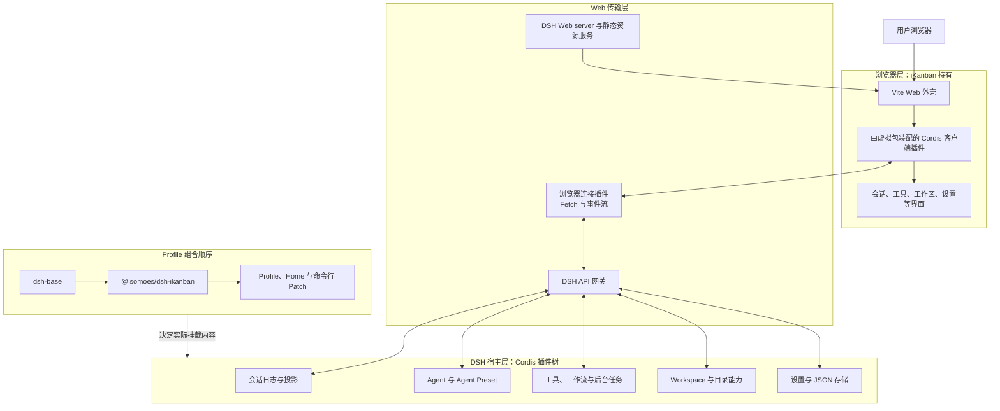
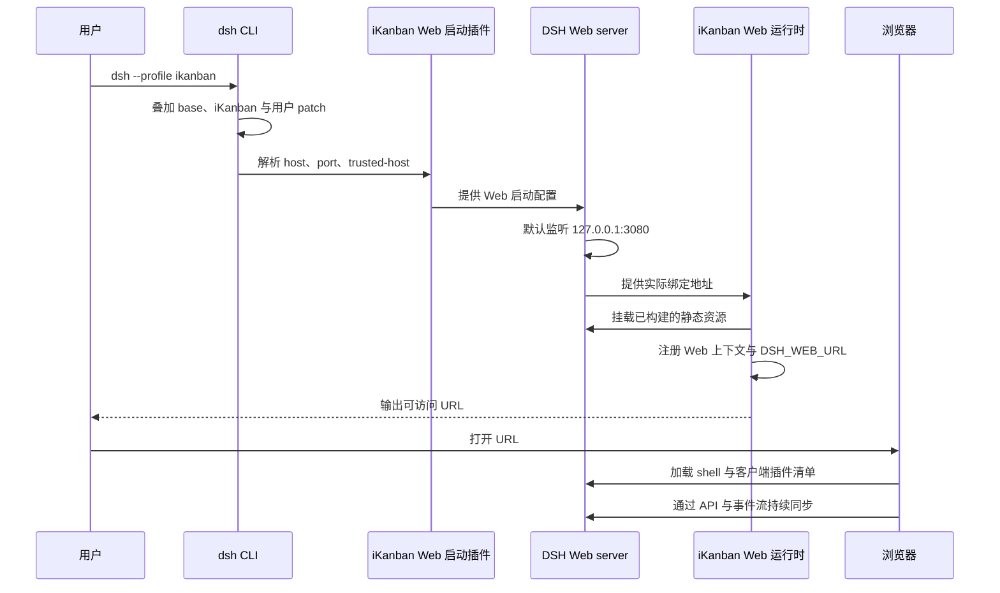
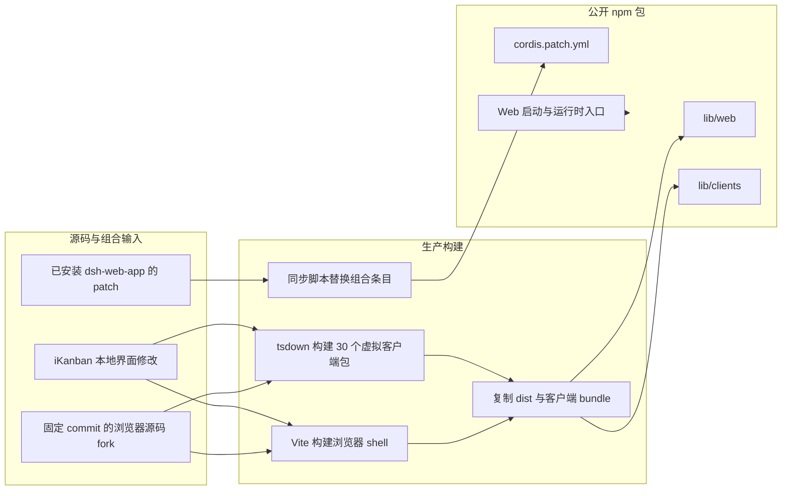

# iKanban v0.4.2：架构与基础功能

本文介绍 iKanban `v0.4.2` 的产品定位、运行架构、基础功能和开发边界。它描述的是当前基于 DeepSeek Harness 的实现，不适用于 `v0.3.x` 及更早的独立 OpenCode Web 应用。

## 版本定位

从 `v0.4.0` 开始，iKanban 被重新实现为 [DeepSeek Harness](https://github.com/deepseek-ai/deepseek-harness) 的 Web 组合包插件。用户安装 `@isomoes/dsh-ikanban` 后，通过一个 DSH profile 启动完整应用，而不是单独启动 iKanban 前端和后端。

`v0.4.2` 的核心定位如下：

- 复用 DSH 的 agent、会话、工具、存储、workspace、API 网关和 Web server 等宿主能力。
- 由 iKanban 提供 Web 启动入口、运行时胶水、浏览器目录选择器和完整浏览器界面。
- 将 Vite shell 和 30 个隔离的浏览器虚拟客户端包打包进一个公开 npm 包。
- 保留 Cordis 的插件化组合能力，允许 profile patch 和命令行 overlay 在 iKanban 之上继续调整配置。
- 继续强化键盘优先的交互方式，并提供 iKanban 品牌、命令面板和构建版本标识。

## 运行时架构

DSH 使用 Cordis 组织插件。一个运行中的 profile 是按顺序叠加的插件树：基础组合包先提供通用 agent 能力，iKanban 再加入 Web 宿主和浏览器插件，用户自己的 patch 最后覆盖前面的配置。

### 组合包边界

公开包 `@isomoes/dsh-ikanban` 的 `dsh.bundle.patch` 指向 `cordis.patch.yml`。构建时，脚本读取当前安装的 `@deepseek-ai/dsh-web-app` 组合配置，并替换以下条目：

- `web-startup` 改为 iKanban 的命令行入口。
- `web-runtime` 改为 iKanban 的静态资源和运行时入口。
- 目录选择器固定为浏览器实现，不要求用户安装原生 addon。
- 上游浏览器插件条目改为 iKanban 包内对应的虚拟客户端包。

其余宿主能力继续由当前安装的 DSH 依赖提供。这样既避免复制整个 DSH 后端，也让 iKanban 可以完整控制浏览器体验。

构建脚本会从本地源码目录动态发现 30 个浏览器条目，并使用 iKanban 自己维护的 Loader 依赖图；其中 28 个直接进入主浏览器 roster，另外两个分别是原生目录选择器和浏览器目录选择器。公开包默认动态挂载浏览器目录选择器，原生版本会被构建，但不会进入默认运行组合。

Cordis patch 会替换目标条目的整个 `config`，而不是只合并单个字段。因此修改组合配置时必须重述该条目拥有的全部配置，并通过 `dsh --profile ikanban-dev --dump-config` 检查最终插件树。

### Web 启动过程

启动入口支持 `--host`、`--port` 和可重复的 `--trusted-host`。默认只监听 `127.0.0.1:3080`；`v0.4.2` 会主动拒绝 `--host 0.0.0.0`，避免在未明确设计完整信任边界前暴露所有网络接口。

### 宿主平面与 Agent Preset 平面

Web 应用需要同时服务多个会话，因此 `v0.4.2` 不会把所有 agent 工具作为进程级单例直接挂载：

- 会话、API、存储、workspace、目标注册表、后台任务注册表等跨会话服务保留在宿主平面。
- Bash、文件系统、skill、计划模式、压缩、subagent、workflow、todo 和 Web 等面向模型的能力由每个会话选择的 agent preset 组合。
- 浏览器可以选择模型、权限 preset 和 agent preset，但真正的执行和权限判断仍在宿主端完成。

这种分层让不同会话可以拥有不同的工具和策略，同时避免为每个会话重复创建本应全局唯一的注册表。

## 基础功能

### 会话与智能体交互

- 创建、搜索和进入工作会话，并支持重命名、fork、归档和排序。
- 在浏览器中查看用户消息、智能体回复和流式输出。
- 以结构化节点展示工具调用、工具结果、工作流运行、用户问题和执行轨迹。
- 处理工具审批和智能体提问，并在输入区展示 todo、排队消息和会话状态。
- 查看会话轮次与步骤统计，并按会话保留当前页面内的滚动位置。
- 切换 workspace 时迁移尚未发送的文字草稿和图片，减少上下文丢失。
- 支持消息反馈、会话日志导出和智能体生成文件的交付物展示。

### 工作区与目录

- 在 Web 界面中创建、选择、重命名、排序和删除 workspace。
- 通过浏览器目录选择器访问宿主暴露的目录能力，无需安装 `koffi` 等原生目录选择依赖。
- 由 workspace 服务维护当前工作区，并通过 API 网关向浏览器提供受控访问。

### 提示词与命令

- 提示词输入支持 `/` 命令和 `@` 引用触发器。
- 可以从输入区域选择命令、文件、skill、subagent 和模型。
- 提供本地命令面板，支持搜索、键盘上下移动和执行操作，并适配桌面与移动布局。
- 支持计划控制、目标栏、后台任务状态和 subagent 状态等会话辅助界面。

### 工具与执行过程

- 提供工具调用树、详情面板和未知工具的通用回退视图。
- 为 Bash、文件读取、写入与编辑、grep、glob、Web、todo 和用户提问提供专用展示。
- 在每个轮次结尾汇总修改工具产生的文件，并允许从结束说明中打开匹配的文件。
- 通过轨迹视图集中查看消息、模型请求、智能体生成、工具调用、压缩过程和耗时。

### 模型、权限与插件设置

- 选择当前会话使用的模型和 agent preset。
- 配置权限 preset，使不同会话采用不同的工具批准策略。
- 在设置界面管理通用选项、模型、主题、语言和可配置插件。
- 查看当前宿主实际加载的插件清单，便于确认 profile 的有效组合。

### 动态 Cordis 插件

- 查看动态插件的版本、运行状态和权限请求。
- 对插件执行单次批准、批准后续版本、拒绝、运行、停止、移除、重试和回滚。
- 为 `cordis_define`、`cordis_run`、`cordis_stop` 和 `cordis_undefine` 提供专用工具卡。
- 在输入区通过 `@pluginId` 引用插件。

### 浏览器体验

- 提供中英文界面、主题和响应式布局。
- 采用键盘优先的会话导航、命令搜索和常用操作方式。
- 显示 iKanban 品牌，并可通过侧栏品牌入口返回首页。
- 在界面中显示发布版本或开发构建标识，便于确认当前运行的构建来源。

常用快捷键如下：

| 快捷键 | 功能 |
| --- | --- |
| `Mod+P` | 打开命令面板 |
| `Mod+Shift+S` | 新建会话 |
| `Mod+B` | 折叠或展开侧栏 |
| `Mod+,` | 打开设置 |

## 浏览器源码与构建方式

`packages/web-ui` 是一个私有 workspace 包，包含从 DSH 固定 commit 导入后再维护的完整 TS、TSX 和 CSS 浏览器源码。上游来源与导入路径记录在 [`packages/web-ui/UPSTREAM.md`](../packages/web-ui/UPSTREAM.md)。更新上游源码必须经过显式、可审查的合并；普通构建不会自动刷新这份源码。

生产构建最终把以下内容放进同一个 `@isomoes/dsh-ikanban` 包：

- `lib/web`：Vite 生成的浏览器 shell 和静态资源。
- `lib/clients`：tsdown 生成的隔离客户端插件。
- `cordis.patch.yml`：基于当前 DSH 依赖同步并替换后的组合配置。
- `lib/index.js`、`lib/startup.js` 等：宿主运行时入口。

## 开发循环

`pnpm dev` 会先构建并把当前 checkout 链接到隔离的 `ikanban-dev` profile，然后同时启动 DSH 和源码 watcher。

- 客户端插件发生变化时，只重建对应虚拟包，并复制到 `packages/ikanban/lib/clients/<id>`；DSH 客户端 HMR 链会重新加载该插件。
- 浏览器 shell 或共享前端代码发生变化时，Vite 重建 `dist` 并复制到 `lib/web`；浏览器需要刷新页面。
- TypeScript 宿主入口、构建脚本、依赖或组合配置发生变化时，需要停止开发进程、重新构建并启动。
- Profile 虽然使用 `link:` 依赖，但运行的是构建后的 `lib` 文件，不会直接执行源码。

## 与 v0.3.x 的主要区别

| 对比项 | `v0.3.x` 及更早版本 | `v0.4.2` |
| --- | --- | --- |
| 产品形态 | 独立 OpenCode Web 前端及配套运行方式 | DSH Web 组合包插件 |
| 后端边界 | 直接围绕 OpenCode API 构建 | 复用 DSH 的 Cordis 服务和 API 网关 |
| 浏览器扩展 | 单体前端内部模块 | 30 个隔离的 Cordis 虚拟客户端包 |
| 安装方式 | 托管页面、npx 或 Docker 等旧方式 | 安装 DSH CLI 和 `@isomoes/dsh-ikanban` profile 插件 |
| 源码维护 | 旧 Web 应用源码 | 固定上游来源的完整可编辑浏览器 fork |
| 热更新 | 旧前端开发服务器行为 | 客户端插件 HMR 与 shell 重建分离 |

因此，旧文档中关于 GitHub Pages、OpenCode server、Docker、旧版 diff 面板或旧会话面板的说明，不应被视为 `v0.4.2` 的当前使用说明。

## 当前边界

- iKanban Web shell 不是可单独打开的静态应用；启动时必须由 DSH 注入浏览器 boot 配置。
- 当前发布包与 DSH `0.1.0-rc.6` 依赖线对齐，实际依赖版本以 `packages/ikanban/package.json` 和 lockfile 为准。
- 浏览器源码的上游刷新是人工审查流程，构建只同步组合配置，不会覆盖本地 UI fork。
- DSH 的共享宿主 HMR 当前关闭；开发模式下启用的是客户端插件重载链。
- `v0.4.2` 默认面向本机访问，不支持通过 `--host 0.0.0.0` 直接监听全部网络接口。

## 代码索引

| 内容 | 位置 |
| --- | --- |
| 公开组合包声明 | [`packages/ikanban/package.json`](../packages/ikanban/package.json) |
| Web 运行时入口 | [`packages/ikanban/src/index.ts`](../packages/ikanban/src/index.ts) |
| Web 命令行入口 | [`packages/ikanban/src/startup.ts`](../packages/ikanban/src/startup.ts) |
| Cordis 组合配置 | [`packages/ikanban/cordis.patch.yml`](../packages/ikanban/cordis.patch.yml) |
| 上游组合同步脚本 | [`packages/ikanban/scripts/sync-upstream.mjs`](../packages/ikanban/scripts/sync-upstream.mjs) |
| 浏览器客户端动态发现 | [`packages/web-ui/build/client-entries.js`](../packages/web-ui/build/client-entries.js) |
| 浏览器启动与插件装配 | [`packages/web-ui/src/client/web/boot.tsx`](../packages/web-ui/src/client/web/boot.tsx) |
| 浏览器源码来源 | [`packages/web-ui/UPSTREAM.md`](../packages/web-ui/UPSTREAM.md) |
| 本地开发编排 | [`scripts/dev.mjs`](../scripts/dev.mjs) |

更早的产品演进请参阅 [`v0.3.1` 到 `v0.3.14`](0.3.1TO0.3.14.md)，当前安装与启动命令请参阅项目根目录的[中文 README](../README.md)。
