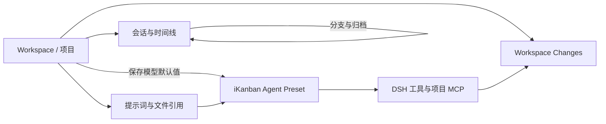
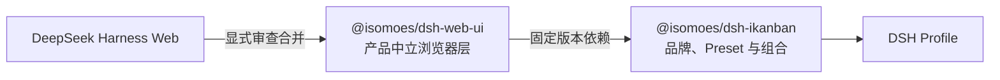

# iKanban v0.5.0：从基础工作台到项目级智能体工作流

本文介绍 iKanban 从 `v0.4.2` 到 `v0.5.0` 的主要变化。`v0.4.2` 完成了向 DeepSeek Harness Web 组合包插件的架构迁移；到 `v0.5.0`，这套基础进一步完善了项目导航、差异审查、会话操作、模型默认值、键盘工作流和局域网访问，并将产品中立的浏览器界面提取为可独立发布、可复用且具备稳定发布流程的共享软件包。

如需了解完整运行架构、Cordis 组合方式和构建边界，请先参阅 [`v0.4.2：架构与基础功能`](0.4.2.md)。

## 版本定位

`v0.5.0` 仍然通过 `@isomoes/dsh-ikanban` 安装到 DSH profile 中，并复用 DSH 的 agent、会话、工具、workspace、存储、API 网关和 Web server。与 `v0.4.2` 相比，这一阶段的演进重点从“建立可运行的 DSH Web 产品”转向“提高日常多项目编码效率”，同时把可复用的浏览器产品层与 iKanban 品牌及组合配置分离，并完善多软件包发布边界。

主要变化可以归纳为七个方向：

- 在提示词中引用 workspace 文件，并通过模糊搜索快速执行 workspace 操作。
- 在会话界面直接查看整个 workspace 的 Git 变更。
- 提供可搜索的会话视图切换和可自定义的快捷键。
- 增加时间线分支、快速归档和自动打开后续会话等会话操作。
- 提供内置 iKanban agent preset，并支持受信任项目的 `.mcp.json`。
- 将模型默认值按 workspace 持久化，并允许用键盘滚动消息历史。
- 将共享 Web UI 发布为 `@isomoes/dsh-web-ui`，让 iKanban 与其他产品复用同一套浏览器基础设施。



## 项目感知的输入与导航

### Workspace 文件引用

从 `v0.4.3` 开始，提示词输入区可以搜索并插入当前 workspace 中的文件引用。输入 `@` 后，可以通过模糊匹配查找文件，而不必先离开会话复制路径。

这一能力与现有的 skill、subagent、模型和插件引用使用同一套输入触发器，使项目上下文可以在编写提示词时直接加入。

### Workspace 快速操作

`v0.4.9` 为命令面板加入 workspace 模糊搜索操作。用户可以通过键盘搜索并打开项目，减少在侧栏和对话之间来回切换。

## 面向代码审查的会话视图

### Workspace Changes

`v0.4.10` 在会话区域加入 **Workspace Changes** 视图，用于查看当前项目的 Git 工作区变更。它与普通对话、执行轨迹等视图并列，适合在智能体完成修改后直接检查项目级差异。

该视图关注整个 workspace，而不是只展示某一次工具调用或某一个会话产生的文件，因此也能反映用户手动修改和其他并行会话留下的变更。

### 紧凑视图切换器

从 `v0.4.7` 开始，会话视图切换器采用更紧凑的布局，并提供可搜索的模式面板。`v0.4.10` 又为视图切换增加了可配置快捷键，使对话、变更和其他视图之间的切换保持键盘优先。

## 会话管理与时间线

### 时间线分支

`v0.4.6` 增加 `/timeline` 命令。用户可以从较早的已完成对话节点创建分支，在新会话中恢复所选消息并继续工作，同时结束并归档原会话。

这一流程适合以下场景：

- 回到较早的决策点尝试另一种实现。
- 保留已完成的上下文，同时避免在原会话中继续累积错误方向。
- 将一次较长探索拆分为更清晰的后续会话。

### 更快的归档流程

`v0.4.4` 增加会话归档命令和快捷键；`v0.4.9` 进一步在归档当前会话后自动打开下一个可用会话。会话切换时输入焦点也会被保留，连续处理多个任务时无需反复点击输入区。

### 消息历史键盘导航

`v0.4.17` 支持使用 `ArrowUp`、`ArrowDown`、`PageUp` 和 `PageDown` 滚动当前对话历史。方向键执行小步滚动，翻页键按接近一屏的距离移动；即使历史区域没有直接获得焦点，也可以继续键盘浏览。

## 可配置的键盘工作流

`v0.4.8` 将固定快捷键扩展为可配置的快捷键系统。设置界面可以为已注册操作修改、禁用或恢复快捷键，并检测按键冲突；配置会持久保存在本地设置中。

在这套系统上，iKanban 又陆续加入了：

- 会话归档操作。
- 会话视图切换。
- Workspace 搜索与打开。
- 侧栏切换，其中 `Mod+L` 在 `v0.4.5` 恢复。
- 命令面板、设置和新建会话等既有操作。

由于快捷键可以由用户修改，运行时应以“设置 → 快捷键”中显示的绑定为准，而不是把某个默认组合视为永久接口。

## Agent Preset 与项目级 MCP

### 内置 iKanban preset

`v0.4.14` 将 **iKanban** 作为只读的内置 agent preset 随包发布。它提供完整编码智能体组合，并在标准能力之上加入项目级 MCP 加载器。`v0.4.16` 隐藏了重复的 Standard preset，但用户配置的自定义 preset 仍可继续使用。

### 项目 `.mcp.json`

选择 iKanban preset 后，项目 MCP 加载器会读取会话实际工作目录中的 `.mcp.json`，让不同 workspace 为智能体提供自己的 MCP server 配置。

这项能力应只用于受信任的项目：项目配置可能启动外部进程或连接外部服务，其权限边界与普通静态项目文件不同。项目 MCP 不会被安装为所有会话共享的宿主级能力，而是属于所选 agent preset 的会话执行平面。

## 模型选择与提醒

### 每个 Workspace 的模型默认值

`v0.4.17` 会记住空白会话中显式选择的 provider 和 model，并将其作为当前 workspace 后续新会话的默认值。

该行为有两个重要边界：

- 默认值按 workspace 隔离，不会把一个项目的模型选择覆盖到其他项目。
- 只对空白会话继承和更新默认值，不会重写已经开始执行的既有会话。

这使不同项目可以稳定使用不同的模型路线，例如在一个 workspace 中默认使用代码模型，在另一个 workspace 中默认使用更适合文档或审查的模型。

### 会话提醒声音

`v0.4.14` 增加可配置提醒声音，可在智能体完成回复或等待权限批准时播放。提醒可以在设置中控制，适合同时观察多个长时间运行会话时使用。

## 主题、反馈与上游能力更新

`v0.4.5` 增加 GitHub Dark Colorblind 主题，为差异和状态颜色提供更高辨识度。后续 DSH Web 源码更新还带来了命令错误提示、文件打开失败恢复、反馈备注编辑、工作流展开控制、模型批量选择、多行提问、更宽的 Markdown 表格和更清晰的权限展示。

运行时依赖经历了以下升级：

| iKanban 版本 | DSH 依赖线 | 主要影响 |
| --- | --- | --- |
| `v0.4.11` | `0.1.0-rc.7` | 更新宿主依赖并保持开发构建标签 |
| `v0.4.12` | `0.1.0-rc.8` | 更新浏览器模块加载、动态 UI、附件和引用能力 |
| `v0.4.15`–`v0.5.0` | `0.1.1-rc.1` | 更新完整运行时和浏览器源码基线 |

文件与会话 `@` 引用的远程 API 注册也在 `v0.4.13` 得到修复，使干净安装的发布 profile 可以正确使用这些引用。

## 可发布的共享 Web UI

`v0.4.18` 将产品中立的浏览器界面提取为公开软件包 [`@isomoes/dsh-web-ui`](../packages/web-ui/README.md)。该包包含经过审查的 DSH Web 源码 fork、Vite shell、语言支持、UI primitives、slot contracts，以及按 `client/*` 暴露的隔离浏览器插件。

这次拆分明确了两层职责：

- `@isomoes/dsh-web-ui` 维护通用会话、工具、设置、主题、workspace 和浏览器运行时，不内置具体产品品牌。
- `@isomoes/dsh-ikanban` 继续拥有 iKanban 品牌、agent preset、项目 MCP、Cordis 组合 patch 和宿主启动入口，并固定经过测试的共享 UI 版本。



共享软件包拥有独立的 trusted publishing 配置和发布产物，因此 iKanban 与 IPaper 等消费产品可以分别固定、测试和升级浏览器层。`v0.5.0` 进一步修复 trusted publishing，通过显式本地路径发布构建生成的 workspace tarball，并将共享 Web UI 保持为构建期 workspace 依赖，避免安装 iKanban bundle 时再把它作为运行时依赖安装。构建仍不会自动刷新上游 fork；来源 commit 和导入路径记录在 [`packages/web-ui/UPSTREAM.md`](../packages/web-ui/UPSTREAM.md)。

## 局域网访问

`v0.4.2` 默认只允许本机访问，并拒绝监听全部网络接口。`v0.4.16` 增加了显式的局域网绑定支持：

```bash
dsh --profile ikanban --host 0.0.0.0
```

开发环境中的对应命令为：

```bash
pnpm dev -- --host 0.0.0.0
```

启动输出会显示可供其他设备打开的局域网地址。客户端应连接该实际 LAN 地址，而不是 `0.0.0.0`。

> 绑定 `0.0.0.0` 会把 DSH 会话及其启用的工具暴露给网络中可访问该端口的客户端。此模式只应在受信任的局域网中使用，并应避免将端口直接暴露到公共互联网。

## 从 v0.4.2 升级后最值得体验的流程

1. 在不同 workspace 中分别选择常用模型，让新会话自动继承项目默认值。
2. 使用 `@` 搜索项目文件，把相关上下文直接加入提示词。
3. 通过命令面板搜索 workspace、会话模式和常用操作。
4. 智能体完成修改后，切换到 Workspace Changes 检查整个项目的差异。
5. 需要改变方向时使用 `/timeline` 从较早节点建立新分支。
6. 为完成回复和权限请求开启提醒声音，以便并行跟进多个会话。
7. 在设置中按自己的工作方式配置快捷键，并使用方向键或翻页键浏览长对话。

## v0.4.3 到 v0.5.0 版本索引

| 版本 | 代表性变化 |
| --- | --- |
| `v0.4.3` | Workspace 文件引用与模糊搜索 |
| `v0.4.4` | 会话归档命令、焦点保持、版本标识 |
| `v0.4.5` | GitHub Dark Colorblind 主题、构建与客户端包边界增强 |
| `v0.4.6` | `/timeline` 时间线分支命令 |
| `v0.4.7` | 紧凑会话视图切换器、模式搜索、项目 MCP preset |
| `v0.4.8` | 可自定义快捷键系统 |
| `v0.4.9` | Workspace 快速操作、归档后打开下一会话 |
| `v0.4.10` | Workspace Changes 与视图快捷键 |
| `v0.4.11` | DSH rc.7、开发标签修复、精简侧栏 |
| `v0.4.12` | DSH rc.8 与浏览器交互能力更新 |
| `v0.4.13` | 修复发布环境中的文件和会话引用 |
| `v0.4.14` | 内置 iKanban preset、会话提醒声音 |
| `v0.4.15` | 迁移到 DSH `0.1.1-rc.1` |
| `v0.4.16` | 局域网绑定、精简内置 preset 列表 |
| `v0.4.17` | Workspace 模型默认值、消息历史键盘导航 |
| `v0.4.18` | 提取并发布产品中立的共享 Web UI 软件包 |
| `v0.5.0` | 修复 workspace tarball 的 trusted publishing，并明确共享 Web UI 仅作为构建期依赖 |

## 当前边界

- iKanban Web shell 仍必须由 DSH 启动并注入 boot 配置，不能作为独立静态页面运行。
- `v0.5.0` 与 DSH `0.1.1-rc.1` 依赖线对齐，实际版本以 [`packages/ikanban/package.json`](../packages/ikanban/package.json) 和 lockfile 为准。
- `@isomoes/dsh-web-ui` 是供 DSH 产品组合使用的浏览器资产和客户端插件集合，不是可脱离 DSH boot 配置单独运行的应用。
- Workspace Changes 展示当前项目的工作区状态，不等同于某个会话的独占修改记录。
- Workspace 模型默认值只影响空白会话，不会迁移或覆盖已有会话的模型选择。
- 项目 MCP 和局域网绑定都扩大了信任边界，应只在可信项目与可信网络中启用。
- 浏览器源码更新仍是显式审查流程，普通构建不会自动拉取上游代码。

完整逐版本记录请参阅项目根目录的 [`CHANGELOG.md`](../CHANGELOG.md)；安装、更新和启动命令请参阅[中文 README](../README.md)。
