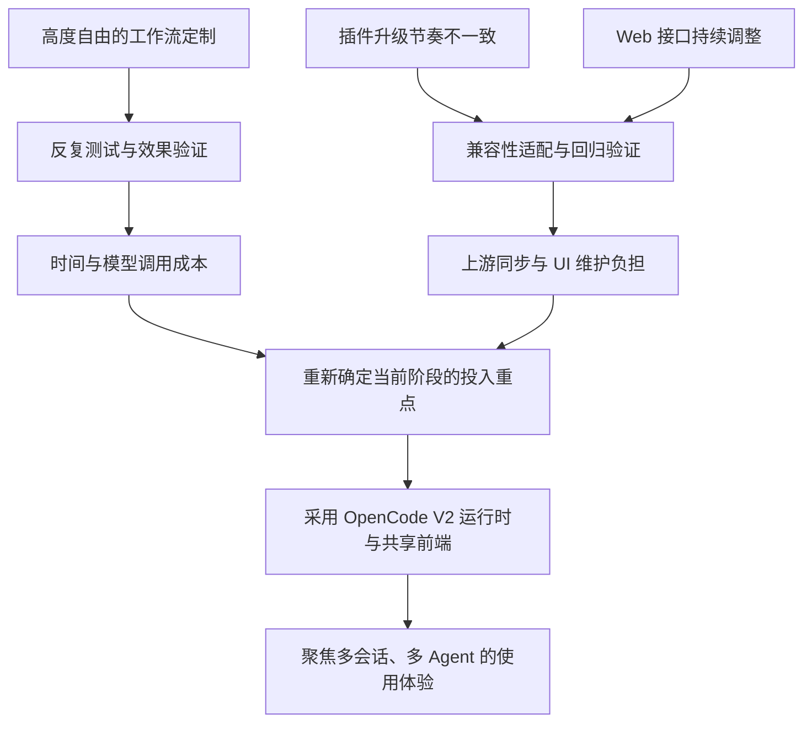
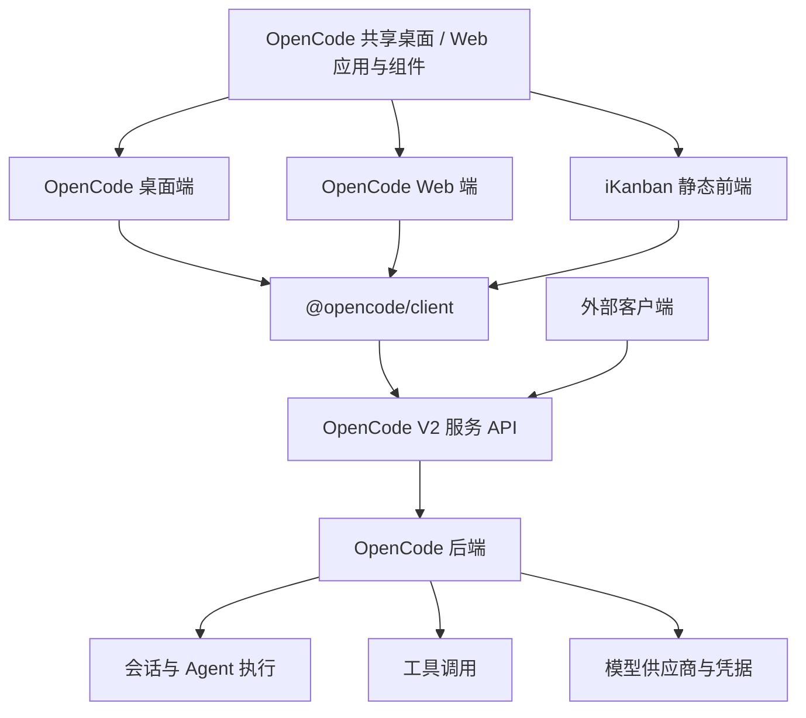
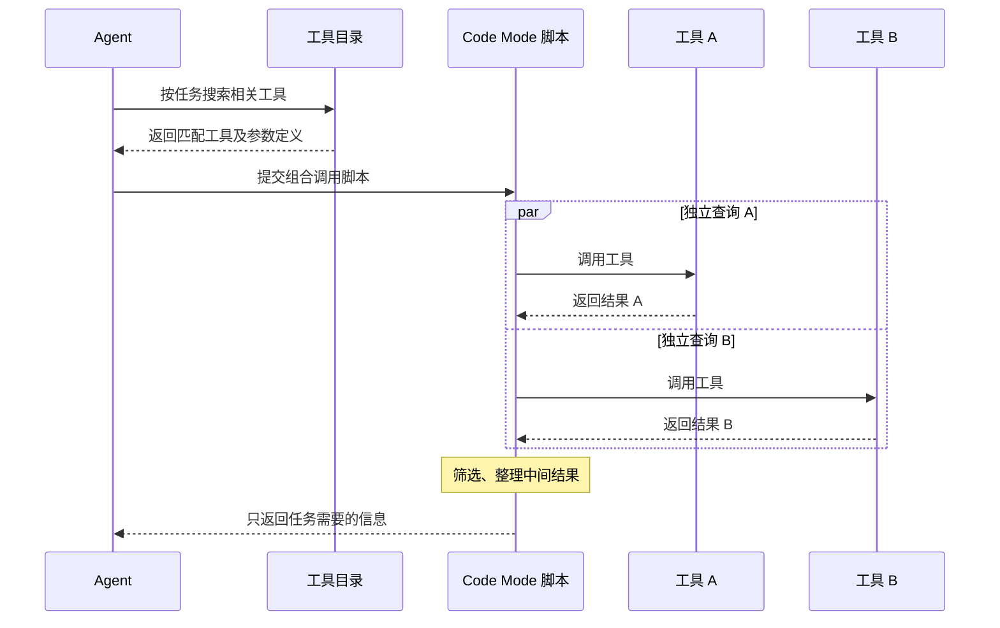
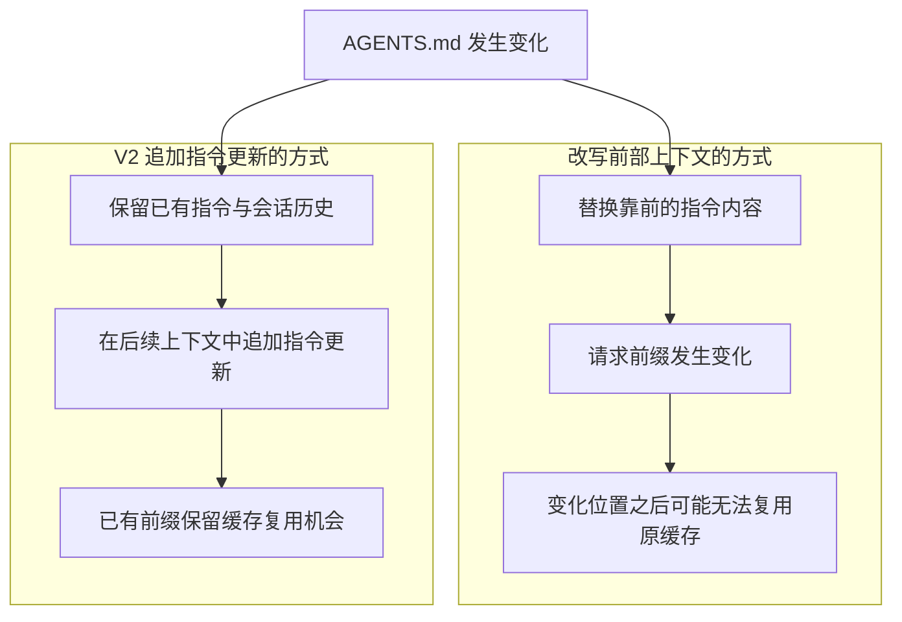

# iKanban v0.5.1 → v0.6.2：为什么回到 OpenCode V2

从 `v0.5.1` 到 `v0.6.2`，iKanban 最重要的变化，是从 DeepSeek Harness（下文简称 DSH）迁移到 OpenCode V2，并直接采用它的共享桌面 / Web 前端。

这次选择的核心，是我们对当前阶段投入重点的重新判断：**把更多时间用于多会话、多 Agent 的实际使用体验，把底层执行机制交给一个持续演进、能够直接复用的 Agent Runtime。**

## 一、为什么离开 DeepSeek Harness

### 高自由度，也意味着更高的验证成本

DSH 最吸引我们的地方，就是它的开放度和自由度。我们可以深入定制工作流，包括：

- 修改 Agent 的系统提示词（system prompt）。
- 调整上下文的注入内容、时机和方式。
- 定义多个 session 之间的信息流转。
- 设计多个 Agent 的分工、交互与协作机制。
- 通过插件组合出符合自己需求的运行环境。

这些能力为探索提供了很大的空间。但能构造一种新的工作模式之后，紧接着就要回答另一个问题：**我们怎么知道它真的有效？**

一套自定义提示词、一种上下文注入方式，或者一种多 Agent 协作模式，在某个任务上表现不错，并不足以证明它在更多任务中同样可靠。要判断收益，就需要反复测试、比较结果、分析失败原因，再继续调整。

这些验证会消耗时间，也会产生模型调用和 Token 成本。对于仍处于早期探索阶段的 iKanban，同时推进产品体验和底层 Harness 实验，会分散有限的精力。现阶段，我们更希望先把已有的运行时能力用好，再围绕真实使用中的问题做改进。

### 插件的升级节奏，让维护变得复杂

另一个原因，来自我们二次开发 DSH Web UI 的实际经历。

DSH 的 Web UI 中，很多逻辑组件本身就是插件。iKanban 的界面和运行环境因此依赖一组相互配合的组件：既有我们自己的插件，也有上游和其他维护者提供的插件。

当整套依赖处于经过验证、相互兼容的版本组合时，这种方式可以很好地工作。但随着系统向前演进，各个插件并不一定以相同速度更新。

例如，我们升级了运行时或 Web 组件，依赖的认证插件却还停留在旧接口上，这两部分就可能无法继续协同工作。此时，升级需要协调的是整套依赖关系，而不只是某一个包的版本号。

对维护二开 UI 的我们来说，这个问题更明显。在此前几次跟进 DSH 的过程中，Web 接口、模块加载方式以及承担界面逻辑的插件都发生过较大的调整。这些变化会传导到我们已经实现的功能上，让一次上游同步变成较大规模的适配和修改。

当时，我们也很难判断这些接口会在什么时间趋于稳定。持续追赶上游变化、修复插件兼容问题、重新验证已有功能，逐渐成为一项较重的维护负担。

因此，离开 DSH 的两个主要原因是：

1. **自由定制带来的效果验证成本，超出了我们当前阶段希望投入的范围。**
2. **插件与 Web 接口的快速演进，让二次开发和上游同步的成本偏高。**

## 二、为什么选择 OpenCode V2

iKanban 在 `v0.3` 系列就曾基于 OpenCode。如果只是重新使用当时的 OpenCode V1 方案，回到旧版本就能作为起点。

这次真正吸引我们的是 OpenCode V2：它在多会话、多 Agent、客户端架构和运行时机制上，提供了值得直接采用的新基础。

### 原生支持多会话与多 Agent 并行

随着模型能力增强、可用 Token 预算增加，我们认为，使用 AI 的一个重要能力差异，会越来越体现在：一个人能否稳定地组织和驾驭多个 Agent。

从跟进一个会话，到同时推进多个任务，需要用户能够分解任务、安排并行工作、跟踪执行状态，并在需要时介入。这对底层运行时和界面的要求都会明显提高。

OpenCode V2 为这种工作方式提供了原生基础：用户可以管理多个会话，主 Agent 也可以通过子会话委派任务，让 subagent 在前台或后台运行，并继续已有的子会话。

对于 iKanban，这意味着我们可以直接围绕已有的会话和任务执行能力构建体验，把精力集中在如何让用户更顺畅地组织、观察和切换这些工作上。

### 共享客户端与 API，让能力更容易复用

此前，iKanban 通过 OpenCode SDK 集成后端能力，并维护自己的界面与适配逻辑。到了 V2，OpenCode 提供了新的服务 API 和原生客户端，我们也进一步采用了上游共享的桌面 / Web 应用。

这里有两个层面的复用：

- **服务层面**：会话、执行、工具、模型供应商和凭据由 OpenCode 后端管理，客户端通过统一的服务 API 使用这些能力。
- **界面层面**：桌面和 Web 共享应用与组件，iKanban 直接采用这套前端，并使用原生 V2 类型、`@opencode/client` 及其 Solid 数据层。

这样，上游在共享应用中完善的能力，就有了更直接的复用途径；外部应用也可以围绕相同的 API 接入。具体功能仍受平台能力影响，例如桌面专属功能需要相应的宿主支持。

对于我们，最直接的价值是减少自行维护界面适配层的负担，并让前端和运行时沿着同一套接口演进。

### 工具按需发现，再通过脚本组合执行

V2 中另一个值得关注的变化，是工具的发现和调用方式。

它的思路与 Skill 的渐进式加载相似：先给模型足够的信息判断有哪些能力可用，再按任务需要获取更完整的内容。对于通过 Code Mode 暴露的工具，Agent 可以先搜索工具目录，找到相关工具及其参数定义，再编写 JavaScript 调用它们。MCP 工具默认也可以通过这条路径使用。

这带来两个实际好处：

1. **减少不相关工具定义占用的上下文。** 工具很多时，不必一开始就把全部详细定义放进模型上下文。
2. **把多次调用组合成一次脚本执行。** 对独立调用进行并行处理，或在脚本内筛选、整理中间结果，只把需要的内容返回给模型。

例如，查询几个不同来源，再提取与当前任务相关的信息，可以在一次脚本中完成，减少逐次交互以及中间结果对上下文的占用。

这种机制为减少 Token 开销提供了空间，也让工具组合更加灵活，便于处理更复杂的任务。

下面以两个相互独立的查询为例，展示一次 Code Mode 执行如何组合多个工具调用：

### 以追加方式更新指令，更有利于缓存复用

还有一类改进不一定会直接体现在界面上，却会影响长会话的成本和效率：上下文中的指令如何更新。

模型的提示词缓存通常依赖请求中相同的前缀。如果继续一个已有会话时，因为项目指令变化而改写了靠前的上下文，那么从变化位置开始，后续内容就可能失去原有的缓存复用机会。

OpenCode V2 对运行中会话的全局和向上发现的项目 `AGENTS.md` 变更，会在下一次模型请求前加入指令更新；移动会话后，目标目录的指令也会作为更新引入。这样的增量处理方式，有利于保留前面的上下文，减少因指令变化而破坏已有缓存前缀的情况。

这里关注的是运行时对指令更新的处理方式。实际缓存收益还取决于模型供应商、请求内容和缓存策略；这一机制也不能直接推广为所有系统提示词变更都不会影响缓存。

## 三、这次迁移如何落到 iKanban 上

从 `v0.5.1` 到 `v0.6.2`，迁移分几步完成：

| 版本 | 主要变化 |
| --- | --- |
| `v0.5.1` | 仍基于 DSH，修复共享 Web UI 的运行时依赖声明与干净安装问题。 |
| `v0.5.2`–`v0.5.3` | 继续完善 DSH 阶段的命令、差异展示与提示词处理。 |
| `v0.6.0` | 移除 DSH 组合包，恢复独立 Web 应用，以旧 `v0.3.18` 界面为起点接入 OpenCode V2。 |
| `v0.6.1` | 采用 OpenCode V2 完整的共享桌面 / Web 前端，以原生类型和客户端替换旧界面适配层。 |
| `v0.6.2` | 完善 iKanban 品牌、主题、会话标签切换快捷键，以及输入和时间线交互。 |

到 `v0.6.2`，iKanban 已成为面向 OpenCode V2 的独立静态前端：

- `packages/web` 是唯一应用，`packages/ui` 和 `packages/session-ui` 提供上游共享组件。
- 浏览器直接连接独立的 OpenCode V2 后端，连接和认证沿用上游实现。
- 会话、Agent 执行、工具以及供应商凭据继续由 OpenCode 管理。
- 前端通过 GitHub Pages 发布，并在共享应用基础上保留 iKanban 的品牌与交互调整。

## 总结

DSH 让我们体验到了高度可定制的 Harness 能提供多大的探索空间，也让我们更清楚地认识到：验证自定义工作模式的有效性，以及维护快速演进中的插件化 UI，都需要持续投入。

在 iKanban 当前阶段，我们选择把这些投入更多地放到实际工作体验上。OpenCode V2 的原生多会话与多 Agent 支持、共享客户端架构、按需发现和组合调用工具的机制，以及更有利于缓存复用的指令更新方式，共同构成了我们希望采用的运行时基础。

**回到 OpenCode V2，是为了让 iKanban 站在更强大、维护负担更可控的 Agent Runtime 上，继续探索如何更好地驾驭多个 Agent。**

## 相关资料

- [完整版本记录](../CHANGELOG.md)
- [当前使用与部署方式](../README.md)
- [上一阶段：v0.4.2 → v0.5.0](0.4.2TO0.5.0.md)
- [OpenCode V2：Agents](https://opencode.ai/v2/docs/agents/)
- [OpenCode V2：JavaScript Client](https://opencode.ai/v2/docs/build/client/)
- [OpenCode V2：Tools](https://opencode.ai/v2/docs/tools/)
- [OpenCode V2：MCP servers](https://opencode.ai/v2/docs/mcp-servers/)
- [OpenCode V2：Instructions](https://opencode.ai/v2/docs/instructions/)
